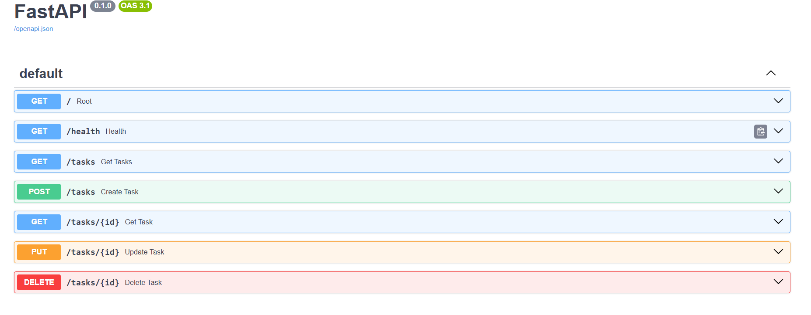

# Task API

A simple REST API for managing a to-do list — create, read, update, and delete tasks. Built with FastAPI as part of my Backend AI Internship at FlyRank.

## Run it

```bash
git clone https://github.com/aminaaso/crud-api.git
cd crud-api
python -m venv venv
venv\Scripts\activate
pip install -r requirements.txt
uvicorn main:app --reload
```

Server runs at `http://localhost:8000`. Interactive docs at `http://localhost:8000/docs`.

## Endpoints

| Method | Path | Description |
|--------|------|-------------|
| GET | / | API info |
| GET | /health | Health check |
| GET | /tasks | List all tasks |
| POST | /tasks | Create a new task |
| GET | /tasks/{id} | Get a single task |
| PUT | /tasks/{id} | Update a task's title and/or done status |
| DELETE | /tasks/{id} | Delete a task |

## Example request
curl.exe -i -X POST http://localhost:8000/tasks -H "Content-Type: application/json" -d '{"title": "Buy eggs"}'

HTTP/1.1 201 Created
content-type: application/json

{"id":4,"title":"Buy eggs","done":false}


## Swagger UI



## Notes

Data is stored in memory only — restarting the server resets tasks back to the 3 seed examples.